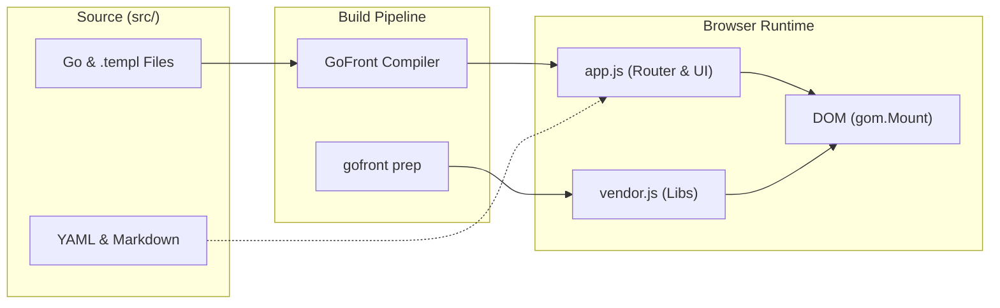
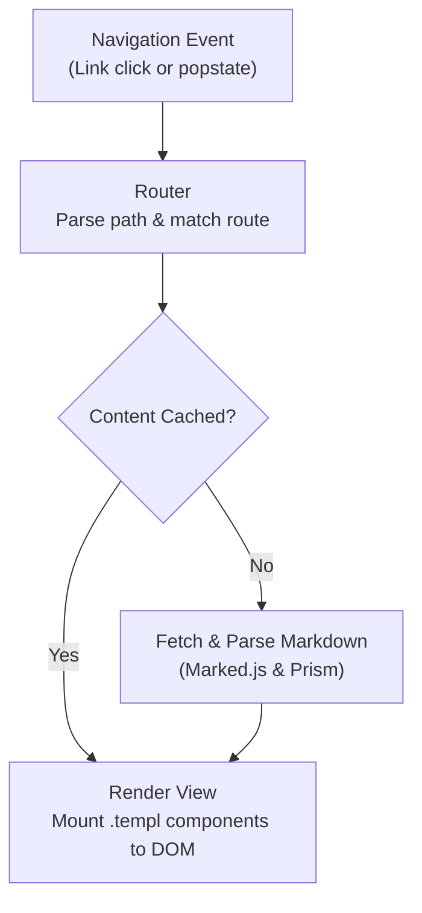

## About

Personal portfolio website built with [GoFront](https://github.com/seriva/gofront) using `.templ` component architecture. Content managed through YAML configuration and markdown files.

**Key Features:** GoFront templ components • Path-based SPA routing • Markdown blog & pages • Fuzzy search (Fuse.js) • Light/Dark themes • GitHub integration • Optional comments (giscus) & contact form (EmailJS)

## Tech Stack

- **Core**: GoFront (`.templ` components, Go-inspired frontend architecture)
- **Build**: `gofront prep` & `npm run prod` • Biome (lint/format) • Playwright (10 E2E suites)
- **Content**: YAML config + Markdown • Pure GoFront YAML parser • Marked.js • Prism.js v1.30
- **Features**: Fuse.js (search) • EmailJS (contact form) • giscus (comments)
- **Assets**: Raleway fonts • Inline SVG icons (local, no CDNs)

## Architecture

The application is written in GoFront under `src/` and compiles to native JavaScript ES modules.

### Overview



### Request Lifecycle



### Key Modules

- **Source (`src/`)**: `main.go` (init, global event delegation) • `ui.go` (region renders, overlay state reconciliation) • `store.go` (state, data, YAML parsing) • `view.go` (`ViewState` + pure route resolvers) • `router.go` (`parseRoute`, SPA routing, async loaders) • `theme.go` (theme persistence & CSS variables) • `markdown.go` (markdown & code highlighting) • `search.go` (Fuse.js search) • `email.go` (EmailJS integration) • `icons.go` (SVG icon registry) • `comments.go` (giscus comments)
- **Components (`src/*.templ`)**: `app.templ` • `navbar.templ` • `blog.templ` • `projects.templ` • `page.templ` • `footer.templ` • `search.templ` • `contact.templ` • `icons.templ`
- **Styles (`app/css/app.css`)**: single plain stylesheet linked from `index.html`, formatted and linted by Biome; loads in parallel with the JS bundles

## Development

**Prerequisites:** Node.js >= 24.0.0, npm >= 11.0.0

## Getting Started

```bash
npm install        # Install dependencies
npm run prepare    # Bundle fonts, themes, dependencies
npm run dev        # Start dev server (http://localhost:8181)
```

Open `http://localhost:8181` in your browser.

### Build for Production

To create an optimized production build:

```bash
npm run prod
```

This will:
- Run code quality checks (`biome check`)
- Bundle and minify vendor dependencies (`gofront prep --minify`)
- Compile, minify, and mangle GoFront application bundle to `public/app.js`
- Copy static assets (`index.html`, `404.html`, `data/`, `fonts/`, `css/`, metadata) to `public/`
- Generate `sitemap.xml` and `rss.xml`
- Output complete, self-contained site to `public/` directory

### Asset Copying

Fonts and Prism themes are automatically copied from npm packages when you run `npm run prepare`. The `assetCopy` configuration in `package.json` defines which assets to copy.

Note: `app/fonts/` and `app/css/prism-themes/` are gitignored as they're auto-generated from npm packages.

### Code Quality Tools

The project uses Biome for code formatting and linting (JavaScript in `scripts/`, and the stylesheet `app/css/app.css`):

- **Format code**: `npm run format`
- **Check code quality**: `npm run check`
- **Auto-format**: Enabled on save in VS Code

All code changes must pass linting before deployment.

### Testing

The test suite covers unit tests and full end-to-end integration tests:

```bash
npm run test:gofront # Run Go unit tests (gofront test, jsdom-backed for DOM code)
npm run test:e2e     # Run E2E tests (Playwright, requires dev server)
npm run test:all     # Run all tests (GoFront + Playwright)
```

Tests cover:
- **Go Unit Tests (`src/*_test.go`)**: route parsing and GitHub Pages redirect decoding, `ViewState` resolvers (cache hit/miss, not found, repo-less projects), content JSON hydration and date sorting, theme precedence/persistence and CSS variable application (jsdom), search guards and result mapping (fake Fuse index), frontmatter stripping, contact validation, render helpers
- **End-to-End Tests (`tests/e2e/`)**: 10 Playwright test suites across Chromium and Firefox:
  - Navigation, history, deep-linking, and route transitions
  - Markdown blog rendering, pagination, and code syntax highlighting
  - Project showcase, links, and tags
  - Light/Dark theme switching and localStorage persistence
  - Fuse.js search modal and query matching
  - EmailJS contact form validation and submission
  - Mobile hamburger navigation drawer
  - 404 and error state fallbacks
- **Type Checking**: GoFront type checker (`npx gofront src --check`)

All quality gates and tests must pass before production builds.

## GoFront Component Architecture

The frontend is built with [GoFront](https://github.com/seriva/gofront) v1.2.0 using declarative `.templ` components and Go:

```templ
package main

templ BlogPostCard(post BlogPost) {
    <article class="blog-post-card">
        <h2 class="post-title">
            <a href={ "/blog/" + post.Slug } data-action="nav">{ post.Title }</a>
        </h2>
        <div class="post-meta">
            <time>{ post.Date }</time>
        </div>
        <p class="post-excerpt">{ post.Excerpt }</p>
    </article>
}
```

**Architecture Highlights:**
- **Zero Runtime Overhead:** `.templ` files compile directly to native DOM manipulation calls (`createElement`, `setAttribute`, `appendChild`) with no virtual DOM diffing.
- **Go Syntax & Type Safety:** Components receive typed props and compile to clean ES modules.
- **Dynamic Content Injection:** Markdown generated from `marked` is injected using `@templ.Raw(doc.HTML)`.
- **Global Event Delegation:** Handled via `data-action` attributes registered centrally on `#app` in `src/main.go`.

## Routing & SPA Support

**Path-based URLs:** `/`, `/blog/`, `/blog/post-slug`, `/project/id`, `/page/id`

**Dev Server:** `gofront src -o app/app.js --serve --port 8181` provides live reload and built-in SPA route fallback (serving `index.html` on clean paths)

**GitHub Pages:** Custom `404.html` redirects deep links via hash (`#!redirect=<path>`), restored to clean URLs with `history.replaceState()` in `src/router.go`

**Absolute Paths:** All resources use root-relative paths (`/app.js`, `/data/content.yaml`) to work from any route depth

**Event Delegation:** Dynamic content uses `data-action` attributes (e.g., `<a data-action="nav">`, `<button data-action="toggle-theme">`) handled centrally in `src/main.go`

## Features & Configuration

All content is managed through `app/data/content.yaml`. The configuration file supports:

### Projects

```yaml
projects:
  - id: "my-project"
    title: "Cool Project"
    tags: ["JavaScript"]
    order: 1
    github_repo: "my-project"  # Auto-loads README
    demo_url: "https://example.com"
    youtube_videos: ["videoId"]
    links:
      - title: "GitHub"
        icon: "github"
        href: "https://github.com/user/repo"
```

**Features:** Auto-load GitHub READMEs • YouTube embeds • SVG icons • Tag organization

### Blog

Create posts in `app/data/blog/` with frontmatter (title, date, excerpt, tags), register in `content.yaml`:

```yaml
blog:
  postsPerPage: 5
  posts:
    - filename: "2025-10-21-post-title.md"
      title: "Post Title"
      date: "2025-10-21"
      excerpt: "Summary"
      tags: ["tag1"]
```

**Features:** GFM markdown • Syntax highlighting • Pagination • Auto-sorting • Tags

### Search

Fuse.js fuzzy search across projects and blog posts (conditionally loaded):

```yaml
site:
  search:
    enabled: true
    minChars: 2
```

**Features:** Fuzzy matching • Weighted results (title 40%, desc 30%, tags 20%, content 10%) • Clickable tag filters • Real-time with debounce • Up to 8 results • Offline support

### Pages

Create markdown files in `app/data/pages/`, configure in `content.yaml`:

```yaml
pages:
  about:
    title: "About"
    showInNav: true
    order: 1
```

### Theme (Light/Dark Mode)

Toggle button with localStorage persistence, system preference support:

```yaml
site:
  theme:
    default: "dark"  # "dark", "light", "auto"
    dark:
      primary: "#10B981"
      code:
        theme: "prism-tomorrow"
    light:
      primary: "#047857"
      code:
        theme: "prism-coy"
```

Prism themes: `prism-tomorrow`, `prism-okaidia`, `prism-dark`, `prism-coy`, `prism-solarizedlight` (bundled locally)

### Comments (giscus)

GitHub Discussions-powered comments via [giscus](https://giscus.app):

```yaml
site:
  comments:
    blogEnabled: true
    projectsEnabled: true
    repo: "username/repo"
    repoId: "R_YOUR_REPO_ID"
    categoryId: "DIC_YOUR_CATEGORY_ID"
```

**Setup:** Enable Discussions on repo → Install giscus app → Get IDs from giscus.app

### Contact Form (EmailJS)

Modal form with email delivery (conditionally loaded):

```yaml
site:
  emailjs:
    enabled: true
    serviceId: "service_xxx"
    templateId: "template_xxx"
    publicKey: "your_public_key"
```

**Setup:** Sign up at emailjs.com → Create service/template with variables `{{title}}`, `{{name}}`, `{{email}}`, `{{time}}`, `{{message}}`

### Internationalization (i18n)

Built-in i18n framework (currently English only):

```yaml
site:
  i18n:
    defaultLanguage: "en"
    availableLanguages: ["en"]

translations:
  en:
    "nav.projects": "Projects"
    "search.placeholder": "Search..."
    # ... more translations
```

**To add a language:** Add to `availableLanguages` (`["en", "nl"]`), copy `en` translations and translate values, use `i18n.setLanguage('nl')` to switch
