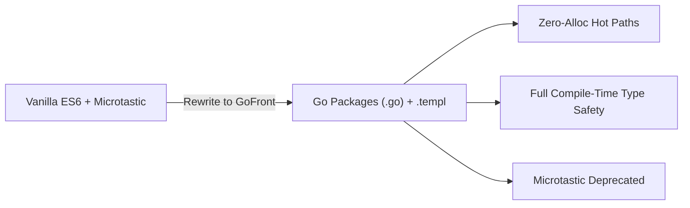

Just a week ago, in [Dogfooding GoFront](/blog/2026-09-24-migrating-from-microtastic-to-gofront), I wrote:

> *"Microtastic is still doing great work in SimpleFPS... and continues to power SimpleFPS."*

Well, that didn't last long.

Over the past week, [SimpleFPS](https://github.com/seriva/simplefps) underwent a complete rewrite. Every single line of JavaScript under `app/src/` is gone. The entire engine—the 120 Hz fixed-timestep physics, spatial octrees, dual WebGL2/WebGPU backends, skeletal animation, WebRTC multiplayer, and HUD/menus—is now written in Go and compiled with [GoFront](https://github.com/seriva/gofront).

And with this migration, the project that gave birth to [Microtastic](https://github.com/seriva/microtastic) has outgrown it.



## Why Leave Microtastic and ES6?

I originally built Microtastic in late 2025 specifically for SimpleFPS to escape enterprise bundler churn with an unbundled, Snowpack-style dev workflow and Rolldown dependency prep.

It worked well, but as the engine grew into a 20,000-line codebase with Quake 3 BSP maps, MD5 skeletal animation, and dual rendering backends, raw ES6 hit hard limits:

- **Refactoring terror**: Renaming a matrix parameter or tweaking an entity hook across dozens of modules meant crossing fingers. One typo or missing property (`pos.z` vs `pos.Z`) meant a runtime crash mid-game.
- **Fighting the GC**: In a 120 FPS shooter, 10 ms garbage collection spikes mean dropped frames. But JavaScript syntax inherently produces garbage—temporary vectors from `gl-matrix`, options objects, and closures. Enforcing zero allocations in JS was swimming against the tide.
- **Mismatched UI paradigms**: In-game menus and the HUD relied on `Reactive.js` (Microtastic's signals library). Synchronizing reactive signals with an imperative, fixed-step 120 Hz loop felt awkward and unnecessary.

## Why GoFront is Better

Porting the engine to GoFront proved to be a massive upgrade across the board:

### 1. Zero-Allocation Hot Paths by Design
Go's value types and explicit pointers allow strict memory control. We replaced `gl-matrix` with our own in-engine math (`physics.Vec3`, `Mat4`, `Quat`) using out-parameter mutation:

```go
func (out *Vec3) Add(a, b *Vec3) *Vec3 {
    out.X = a.X + b.X
    out.Y = a.Y + b.Y
    out.Z = a.Z + b.Z
    return out
}
```

Caller-provided query buffers (`RaycastResult`), fixed-capacity slices with swap-remove, and package-level scratch vectors keep hot paths allocation-free. Our perf test (`tests/perf/zero-alloc.js`) runs **100,000 raycasts under 64 KB of new-space heap growth**, delivering rock-solid 120+ FPS with **0 bytes allocated per frame**.

### 2. Type-Safe Pipeline State & Crisp Seams
Render states (blend modes, depth test, culling) were previously loose strings. In GoFront, they are typed enums in a single `PipelineState` struct, allowing backends to diff state and eliminate redundant GPU calls. We also cleanly separated lifecycle (`scene.Entity`) from drawing (`rendering.Drawable`), eliminating runtime type assertions on the render path.

### 3. Declarative UI with `.templ` & Mount-Time Refs
Menus, the HUD, loading screens, and mobile virtual controls are now GoFront `.templ` components. They compile to direct DOM calls with zero virtual DOM overhead, while all styles live in `app/style.css` which `gofront dev` hot-swaps live without reloading or dropping game state.

To keep the 120 FPS HUD update loop completely allocation-free, this migration directly drove GoFront's new `ref="name"` template feature: instead of querying the DOM with `document.getElementById` or re-rendering components every frame, `.templ` captures DOM element references into a `refs map[string]any` directly at mount time.

### 4. A Single Unified Toolchain
GoFront replaces multiple ad-hoc scripts:
- `gofront dev` for live reload and instant CSS swaps.
- `gofront check app/src/...` for multi-package type checking.
- `gofront test` (and `gofront test --dom` with jsdom) for headless unit testing.
- `gofront prep` for bundling external dependencies like PeerJS.
- `gofront build --pwa` for production releases.

### 5. Hardening the Compiler
Dogfooding a full 3D game engine pushed GoFront to its limits, directly driving upstream fixes in releases 1.3.7–1.3.12: pointer receiver unboxing, imported struct zero-init, mount-time `ref` bindings, `sort.Slice` index semantics, release asset whitelisting, and multi-package source-map resolution.

## The Trade-offs

Writing a game engine in a custom compiled Go-to-JS toolchain isn't without friction:

1. **JS emission quirks**: GoFront compiles to clean JS without a heavy runtime, so certain Go idioms (`append`, slice literals, struct value copies) allocate under the hood and must be avoided on hot paths. Also, method values are emitted unbound, requiring explicit interfaces (`RaycastProvider`) for cross-package hooks.
2. **Dynamic browser boundaries**: Interfacing with WebGL2, WebGPU, and WebRTC still relies on `.d.ts` definitions and occasional `any` casts when handling dynamic browser events.
3. **The compiler-author tax**: When you hit a bug, you can't search StackOverflow. You have to open the compiler AST emitter, fix the bug, publish an upstream release, and bump your dependency before you can get back to building your game.

## Retiring Microtastic

Microtastic was born to serve SimpleFPS. Later, it powered my website.

Now, both projects run 100% on GoFront. GoFront handles dependency bundling (`gofront prep`), dev serving, UI components (`.templ`), and production builds, rendering Microtastic's Rolldown wrapper and `reactive.js` entirely redundant.

With zero remaining projects using it, **Microtastic is officially deprecated and moving into archive mode**. It was a great stepping stone that freed my workflow from Webpack, but full-stack Go is simply a better world.

---

With the rewrite done, SimpleFPS can refocus on gameplay: next up are [engine pass cleanup](https://github.com/seriva/simplefps/blob/master/docs/architecture.md), mobile G-buffer depth reconstruction, and expanded P2P multiplayer.

Check out [SimpleFPS](https://github.com/seriva/simplefps) and [GoFront](https://github.com/seriva/gofront) on GitHub.
