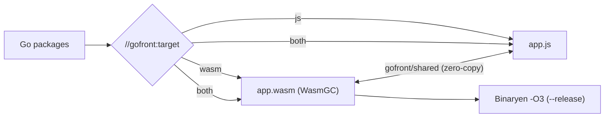

In [GoFront 1.5](https://github.com/seriva/gofront/blob/master/CHANGELOG.md) I introduced an experimental WasmGC backend and per-package compilation targets. It worked, but it was a proof of concept: plenty of Go simply wasn't supported yet in `wasm` packages.

Version 1.6, released today, closes most of that gap. It is also the first release where the hybrid model has real numbers behind it, measured on [SimpleFPS](/blog/2026-10-01-migrating-simplefps-from-microtastic-to-gofront).



## A Much More Complete Language

`wasm` packages now support the parts of Go that people actually use:

- **Interfaces**: non-empty interfaces with dynamic dispatch over the known set of implementing types.
- **Generics**: generic functions and structs are monomorphised, as in the JS backend.
- **Maps**: an insertion-ordered runtime that matches JS `Map` order, with Go semantics for struct keys, `-0.0` and `NaN`.
- **`defer`/`panic`/`recover`**: built on native wasm exception handling (`try_table` + `exnref`).

`recover()` also got stricter in **both** backends. It now follows Go's scoping rules: it only stops a panic when called directly by a deferred function. Before, the JS backend would happily recover from anywhere in the call chain.

## A Wider Standard Library

The stdlib available in `wasm` packages grew from `math` to a useful chunk of everyday Go:

`errors`, `fmt`, `strings`, `strconv`, `unicode/utf8`, `slices`, `maps` and `sort`, next to `math`, `math/bits` and `testing`.

`error` values are real wasm structs, and `t.Run` subtests work inside `app.wasm`. When something isn't implemented yet, the compiler tells you and suggests moving the call to a JS package:

```
'strings.Map' is not yet available in wasm packages
```

## Zero-Copy Shared Buffers

The boundary between JS and wasm is where hybrid apps lose performance. The new `gofront/shared` package gives `wasm` code typed buffers that JS sees as **TypedArray views over the module memory**, with no copying:

```go
package sim

import "gofront/shared"

var Positions = shared.NewFloat32(4096)

func Step(dt float32) {
    for i := range Positions {
        Positions[i] += dt
    }
}
```

On the JS side, `sim.Positions` is just a `Float32Array` you can hand straight to a canvas or WebGL buffer. Allocation is limited to package-level initialisers and `init()`, so the memory is sized once and views never detach. In JS-only builds the buffers lower to plain TypedArrays, so the same code runs everywhere.

The new `example/hybrid` project shows this end to end: a particle simulation stepped in wasm and drawn on a canvas from JS, with a Playwright E2E test.

## Smaller and Faster Builds

- **Binaryen optimisation**: `gofront build --release` (or `--wasm-opt`) runs `app.wasm` through Binaryen (`-O3` plus `--gufa`), validates the result and reports the savings, roughly **19–23%**. It prefers a native `wasm-opt` on your `PATH` and falls back to the optional `binaryen` npm package.
- **Source maps**: `--source-map` now also writes `app.wasm.map`, kept correct through optimisation.
- **Leaner bundles**: import shims are only emitted when a `wasm` package uses them.

## Target Overrides

You can now flip targets without editing source. `--js-only` compiles everything to JavaScript, which is handy for A/B comparisons. `gofront.json` can pin targets per package:

```json
{
  "targets": { "engine/physics": "wasm" }
}
```

## Does It Pay Off?

I moved SimpleFPS's `physics` and `animation` packages to `wasm` and measured:

| Workload | Speed vs. JS |
| --- | --- |
| Raycasts | 1.11–1.15× |
| FPS-controller fixed step | 2.4× |
| 64-joint skinning (with a `gofront/shared` palette) | 1.27× |

With `--release`, `app.wasm` shrank from 98.5 to 79.7 kB. The controller loop also dropped from about 48 B/frame to 0.2 B/frame of allocation, which matters when you are chasing zero allocations at 120 FPS.

The honest takeaway: wasm is not a free win. Chatty calls across the boundary can cost more than they save. GoFront now warns when a `js` package calls into `wasm` from inside a loop, and the README has a step-by-step "choosing a target" checklist.

## Fixes Worth Mentioning

Moving more code through the wasm backend shook out a lot of bugs:

- `strconv` now returns proper Go-style errors in the JS backend, and both backends share one parser.
- `fmt.Println` no longer treats its first argument as a format string.
- Calling wasm handle methods with `int` parameters from JS no longer throws a `BigInt` error.
- `math.Round` rounds half away from zero like Go.
- `app.wasm` is resolved relative to `app.js`, so sub-path routes and CDN hosting work.
- `gofront dev` without `-o` no longer serves stale output.

The [changelog](https://github.com/seriva/gofront/blob/master/CHANGELOG.md) has the full list.

## Upgrading

```bash
npm install gofront@1.6.0
```

`wasm` packages need a WasmGC-capable runtime: Node 22+ or a recent Chrome, Firefox or Safari. `gofront test` now checks the Node version and tells you if it is too old.

If you rely on `Println`/`Print` receiving a format string, switch those calls to `Printf`/`Sprintf`.

---

Next up is GoFront 2.0: a rewrite of the compiler core in native Go, with byte-identical JS and wasm output and no Node requirement for `dev`, `build` and `check`.

Try [GoFront](https://github.com/seriva/gofront) on GitHub and let me know how it goes.

